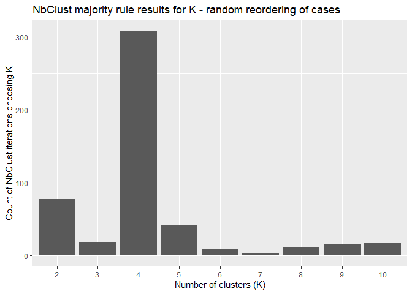
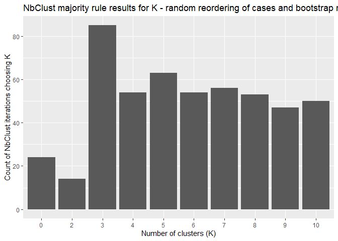
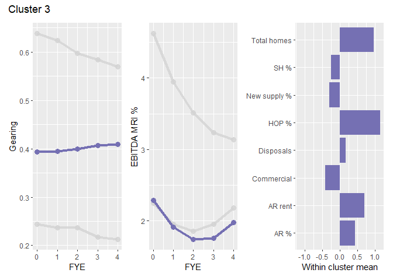
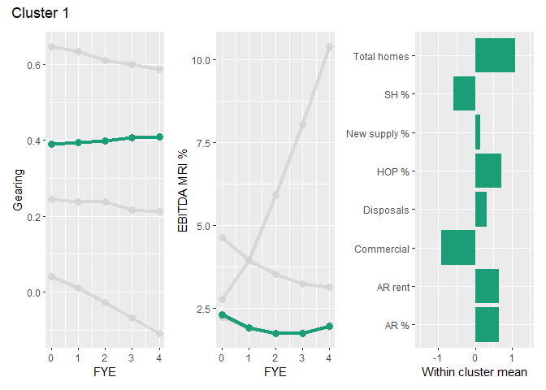
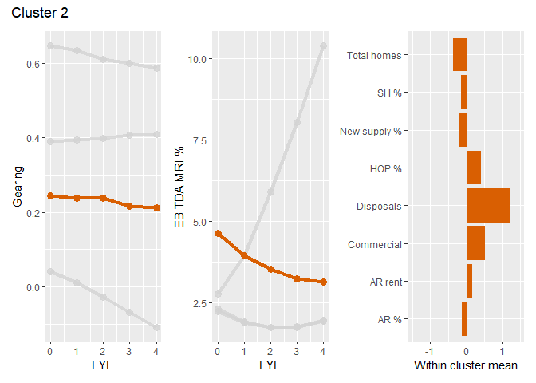
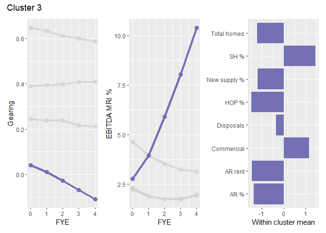
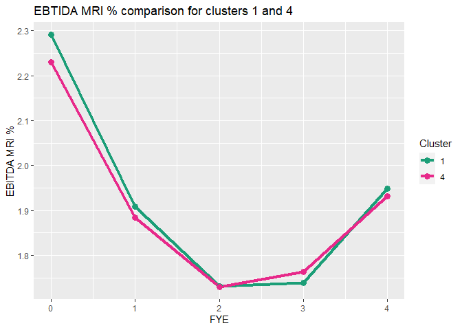

longitudinal_clustering_markdown
================
2022-11-01

## Background - The problem with the regression analysis

Previous longitudinal regression looked at two dependent variables:

-   Gearing, which is total debt over total assets, where a higher
    number means a housing association has higher levels of
    indebtedness  
-   EBITDA MRI %, which is earnings over interest payments, where a
    lower number means a housing association has higher interest
    payments relative to their revenue

The regression results suggested gearing was predicted by organisational
size, tenure mix (i.e. the proportion of affordable rented, supported
housing and older persons homes), and development ambitions. EBITDA MRI
% was predicted by financial year, organisational size, and commercial
surplus.

The issue with this approach is that financialisation is not a
continuum - at least not how I have conceived it - and so higher gearing
and lower EBITDA MRI don’t necessarily mean *more* financialisation.
Rather, variegated financialisation implies that both the degree and
nature of financialisation varies across contexts and scales. Gearing
and EBTIDA MRI are useful and relevant indicators of the relationship an
organisation has with debt finance, and ones that can be used to explore
the different facets and manifestations of the concept, but it may be
problematic to use them as dependent variables intended to measure
financialisation.

To give an example, there is an ongoing scandal in the housing
association sector relating to lease-based supported housing providers.
These are typically small providers of supported housing that have
exempt rents - i.e. rents exempt from Housing Benefit caps, and
therefore typically rents that are higher than the average - but do not
own the housing, instead they lease the housing from a private investor.
The sector has been embroiled in scandal because the lease arrangements
often transfer significant commercial risk to the association, with
lease payments increasing at a rate that can’t be supported by rental
revenue putting the financial viability of the association at risk,
while the profits extracted by investors from exempt rents are high, and
the standards provided to tenants often very poor. There seems little
doubt that the lease-based supported housing scandal represents a
manifestation of financialisation, but because the housing is leased,
they typically have very low gearing and high interest cover. Some
providers are even massive outliers in this respect. And so in the
longitudinal regression they would be seen as *less financialised*, but
a more accurate description would be to say that the form of
financialisation actually differs in nature, and with consequences that
are particularly acute for tenants.

## Alternative approach - Longitudinal k-medoids clustering

An alternative approach that utilises the strengths of the longitudinal
regression, but is more congruent with the conceptualisation of
financialisation as variegated, is to conduct longitudinal clustering on
gearing and EBITDA MRI %. The benefit of clustering is that it
represents an exploratory approach that categorises housing associations
according to their relationship with debt finance over time, without
implying an association is necessarily more or less financialised.

A recent study by [Den Teuling *et al.*
(2021)](https://www.tandfonline.com/doi/full/10.1080/03610918.2020.1861464)
compared the performance of different longitudinal clustering methods
where trends are non-linear. Based on the results of monte-carlo
simulations, they recommend an approach refered to as **growth curve
k-means (GCKM)**, due to its high performance and computational
efficiency. GCKM first builds a longitudinal regression model using a
multilevel framework, typically with a polynomial fit of degree
specified by the researcher for the time variable, and then conducts
k-means clustering on the random effects for each group.

To understand the financialisation of the English housing association
sector I apply and extend GCKM to housing association balance sheet data
from 2017-2021. I extend GCKM by taking the random effects from two
depednent variables - gearing and EBITDA MRI%, both with a two degree
orthogonal polynomial for financial year - and also applying k-medoids
as it less sensitive to the outliers that are present in the long-tailed
EBITDA MRI% distribution. Nonetheless, four outlier organisations are
removed due to their extreme EBITDA MRI%, which when included cause
clusters to emerge made up of single organisations.

## Data preparation

The code below takes the dataset from the EBITDA-MRI longitudinal
modelling. It centres the financial year variable (`fye_int`) by
subtracting 2017. It then creates an ID variable for each housing
association that is used to match clusters to cases.

``` r
df <- lt_clus_df %>% 
  #filter(rp_code %in% five_yrs) %>% 
  mutate(fye_c = fye_int - 2017)

ids <- tibble(
  rp_code = df$rp_code %>% unique(),
  id = seq(1, df$rp_code %>% unique() %>% length(), 1)
)

df <- df %>% 
  left_join(ids, by = "rp_code") %>% 
  arrange(id)
```

The code below creates the data frame that will be used for clustering.
First it builds two longitudinal models using a multilevel modelling
approach. The models use gearing and EBITDA MRI as the dependent
variable, respectively, and specify a two-degree orthogonal polynomial
for year. The random effects from each model are then extracted,
standardised by their z-score, mean-centred, and combined into a single
data frame (`combined`). The model predictions for each housing
association are also extracted and combined into dataframe
(`pred_traj`), as these will be used later for visualising the clusters.

``` r
ids <- unique(df$id)

# formulae
model <- ebitda_mri~poly(fye_c, degree=2) + (1 + fye_c|id)
model2 <- gearing~poly(fye_c, degree=2) + (1 + fye_c|id)  

# ml models
gcm <- eval(substitute(lmer(formula = model, data = df, REML = FALSE)))
gcm2 <- eval(substitute(lmer(formula = model2, data = df, REML = FALSE)))

# predictions per RP
Pred <- predict(gcm, df)
Pred2 <- predict(gcm2, df)

# random effects per model
R <- ranef(gcm)$id %>% scale
R2 <- ranef(gcm2)$id %>% scale
colnames(R) <- str_c("ebit_",colnames(R))
colnames(R2) <- str_c("gear_",colnames(R2))

# combined random effects into single table
combined <- cbind(R, R2)

# predicted trajectories
pred_traj <- data.table(df %>% select(id, fye_c), Pred)
pred_traj2 <- data.table(df %>% select(id, fye_c), Pred2)
pred_traj <- pred_traj %>% left_join(pred_traj2, by = c("id","fye_c"))
```

## Identifying K

The code below uses the `NbClust` function to try and identify the
optimal K for kmeans. 500 iterations of NbClust are run, with random
reordering of the rows in each iteration. The majority rule choice of K
is saved for each iteration in vector `best_k`.

As a comparison, another 500 iterations of NbClust are run with random
reordering of the rows in each iteration, and a bootstrap resample of
cases in each iteration. The majority rule choice of K is saved for each
bootstrap iteration in vector `boot_k`.

The results are presented in the bar charts below. The `best_k`
suggested K=4 was optimal, and this was a unanimous choice among the
iterations. Whereas the `boot_k` suggested K=3 was optimal, but in this
approach there was a more even spread across potential solutions for K.

``` r
# nbclust with reordering ---------------------------------------

best_k <- rep(NA, 500)

for(i in 1:500){
  
  dat <- combined
  set.seed(i)
  rows <- sample(nrow(dat))
  dat <- dat[rows, ]
  #df_boot <- sample(df, size = nrow(df), replace = TRUE)
  
  k_search <- NbClust(dat, min.nc = 2, max.nc = 10, method = "kmeans")
  best_k[i] <- k_search$Best.nc[1,] %>% getmode()
  
}

# nbclust with reordering and bootstrap ---------------------------------------

boot_k <- rep(NA, 500)

for(i in 1:500){
  
  dat <- combined
  set.seed(i)
  rows <- sample(nrow(dat))
  dat <- dat[rows, ]
  df_boot <- sample(dat, size = nrow(dat), replace = TRUE)
  
  k_search <- NbClust(df_boot, min.nc = 2, max.nc = 10, method = "kmeans")
  boot_k[i] <- k_search$Best.nc[1,] %>% getmode()
  
}
```

``` r
p1 <- ggplot(data = NULL, aes(x = as.factor(best_k))) +
  geom_bar() +
  labs(x = "Number of clusters (K)",
       y = "Count of NbClust iterations choosing K",
       title = "NbClust majority rule results for K - random reordering of cases")
p1
```

<!-- -->

``` r
p2 <- ggplot(data = NULL, aes(x = as.factor(boot_k))) +
  geom_bar() +
  labs(x = "Number of clusters (K)",
       y = "Count of NbClust iterations choosing K",
       title = "NbClust majority rule results for K - random reordering of cases and bootstrap resampling")
p2
```

<!-- -->

## kmeans K=3

The results of a K=3 solution are presented below. Penn portraits are
produced showing the gearing and EBITDA MRI 5 trajectory for each
cluster, as well as the within cluster mean for a number of
theoretically important covariates (e.g. size, affordable rent % etc.).
Cluster trajectories for gearing and EBITDA MRI % calculated by taking
the cluster mean of the initial model predictions (i.e. `pred_traj`).
The covariates are scaled by their z-score and mean centred to make the
reading of the graphs easier.

The results suggest three clusters:

1.  Cluster 1 (n = 64): highly geared associations with ambitious
    development plans  
2.  Cluster 2 (n = 20): low gearing and high (but-falling) EBITDA MRI,
    either supported housing providers or associations engaged in
    disposals  
3.  Cluster 3 (n = 178): mid-level gearing and low EBITDA MRI, either
    large associations or older persons housing providers, with less
    ambitious development plans

``` r
set.seed(123)
k3 <- kmeans(combined, centers = 3, nstart = 1000)

k3$centers
k3$size

clusters_k3 <- k3$cluster

pred_traj[, Cluster_k3 := clusters_k3[id]]

dt_trends <- pred_traj %>% 
  group_by(Cluster_k3, fye_c) %>% 
  summarise(ebitda_mri = mean(Pred),
            gearing = mean(Pred2),
            .groups = "drop")
dt_trends$Cluster_k3 <- as.factor(dt_trends$Cluster_k3)

# store results
k3_sum <- list(df,
               clusters = tibble(id = ids, cluster = as.factor(clusters_k3)),
               centers = k3$centers,
               dt_trends=dt_trends, 
               size = k3$size,
               numclus=3)
```

``` r
# visualising results
summ_vars <- c("social_stock_total", "pct_sh", "pct_hop","pct_ar", "ar_rent_mean",
               "new_social_pct", "disposals_over_shl_surplus",
               "commercial_over_shl_surplus")

range_means <- df %>% 
  left_join(k3_sum$clusters, by = "id") %>% 
  group_by(cluster) %>% 
  summarise(
    across(
      all_of(summ_vars),
      mean
    )
  ) %>%
  select(-cluster) %>% 
  sapply(scale) %>% 
  as_tibble() %>% 
  mutate(cluster = 1:3) %>% 
  pivot_longer(social_stock_total:commercial_over_shl_surplus,
               names_to = "var",
               values_to = "cluster_mean") %>% 
  select(cluster_mean) %>% 
  as_vector() %>% 
  range()

var_names <- tibble(
  var = c("social_stock_total", "pct_sh", "pct_hop","pct_ar", "ar_rent_mean",
          "new_social_pct", "disposals_over_shl_surplus",
          "commercial_over_shl_surplus"),
  var_names = c("Total homes", "SH %", "HOP %", "AR %", "AR rent",
                "New supply %", "Disposals", "Commercial")
)
```

``` r
# penn portraits, k=3
my_palette <- brewer.pal(n = 4, name = "Dark2")
clust_plots_k3 <- list()

for(i in seq_along(1:3)){
  
  my_level <- as.character(i)
  plot_title <- str_c("Cluster ", i)
  
  dat <- k3_sum$dt_trends %>% 
    mutate(clust_int = parse_number(as.character(Cluster_k3))) %>% 
    mutate(clust_col = as.factor(ifelse(clust_int == i, 1, 0)))
  
  g1 <- dat %>% 
    ggplot(aes(x = fye_c, y = gearing, group = Cluster_k3)) +
    geom_line(colour = "lightgrey", size = 1.5, alpha = 0.8) +
    geom_point(colour = "lightgrey", size = 3, alpha = .8) +
    geom_line(data = dat %>% filter(clust_col == 1),
              aes(x = fye_c, y = gearing), size = 1.5,
              colour = my_palette[i]) +
    geom_point(data = dat %>% filter(clust_col == 1),
               aes(x = fye_c, y = gearing), size = 3,
               colour = my_palette[i]) +
    labs(x = "FYE", y = "Gearing") +
    theme(legend.position = "none")
  
  g2 <- dat %>% 
    ggplot(aes(x = fye_c, y = ebitda_mri, group = Cluster_k3)) +
    geom_line(colour = "lightgrey", size = 1.5, alpha = 0.8) +
    geom_point(colour = "lightgrey", size = 3, alpha = .8) +
    geom_line(data = dat %>% filter(clust_col == 1),
              aes(x = fye_c, y = ebitda_mri), size = 1.5,
              colour = my_palette[i]) +
    geom_point(data = dat %>% filter(clust_col == 1),
               aes(x = fye_c, y = ebitda_mri), size = 3,
               colour = my_palette[i]) +
    labs(x = "FYE", y = "EBITDA MRI %") +
    theme(legend.position = "none")
  
  
  g3 <- df %>% 
    left_join(k3_sum$clusters, by = "id") %>% 
    group_by(cluster) %>% 
    summarise(
      across(
        all_of(summ_vars),
        mean
      )
    ) %>%
    select(-cluster) %>% 
    sapply(scale) %>% 
    as_tibble() %>% 
    mutate(clust_int = 1:3) %>% 
    filter(clust_int == i) %>% 
    pivot_longer(social_stock_total:commercial_over_shl_surplus,
                 names_to = "var",
                 values_to = "cluster_mean") %>% 
    left_join(var_names, by = "var") %>% 
    ggplot(aes(x = cluster_mean, y = var_names)) +
    geom_col(fill = my_palette[i]) +
    labs(y = NULL, x = "Within cluster mean") +
    coord_cartesian(xlim = range_means) 
  
  my_patch <- g1 + g2 + g3
  
  clust_plots_k3[[i]] <- my_patch + plot_annotation(
    title = plot_title
  )
  
}

clust_plots_k3
```

    ## [[1]]

<!-- -->

    ## 
    ## [[2]]

<!-- -->

    ## 
    ## [[3]]

<!-- -->

## kmeans K=4

The results of a K=4 solution are presented in a similar fashion below,
except an additional plot has been produced to show the overlapping
EBITDA MRI trajectories of clusters 1 and 4. The clusters include:

1.  Cluster 1 (n=175): mid-level gearing and low EBITDA MRI, either
    large associations or older persons housing providers, with less
    ambitious development plans
2.  Cluster 2 (n=20): mid-to-low gearing with relatively high (but
    falling) EBITDA MRI, relatively small assocoiations with either
    active disposals programmes or a resonable provision of older
    persons housing  
3.  Cluster 3 (n=2): very low (and falling) gearing, high (and rapidly
    rising) EBITDA MRI, small supported housing providers  
4.  Cluster 4 (n=65): high gearing and low EBITDA MRI, developing
    housing associations

Given that the addition of cluster 3 is the primary separation between
each solution, and that cluster 3 is made up of only two cases, it makes
intuitive sense than k=3 was the most frequent bootstrap NbClust
solution, as these two cases would be ommitted from the resampling in a
number of iterations. Therefore, there are merits to choosing either
cluster solution. One of the benefits of choosing a four cluster
solution is the congruence with theory. To illustrate, the following
quote is taken from the annual accounts of one of the housing
associations in Cluster 3:

*“Gearing is low compared to many housing associations. This is because
the primary constraint on our housing development is the availability of
capital grants and ongoing revenue funding, both of which affect our
operating margins, rather than loan finance. It would be possible to
borrow more and thus develop more quickly, but the risks in doing so are
higher than the Board can accept given our margins.”*

This quote illustrates how financialisation lands differently in
different contexts because it shows how the terms of borrowing for
supported housing providers are stricter due to their tighter margins
and reliance upon an unreliable subsidy regime. It also shows how
financialisation is then negotiated within the historical and spatial
context of each organisation, with this particular association choosing
to adopt a risk-averse approach, which can be contrasted with the
approach of lease-based supported housing providers, who have pursued
bullish growth via risky financial arrangements.

``` r
# k = 4 -------------------------------------------------------

set.seed(123)
k4 <- kmeans(combined, centers = 4, nstart = 1000)

k4$centers
k4$size

clusters_k4 <- k4$cluster

pred_traj[, Cluster_k4 := clusters_k4[id]]

k4_trends <- pred_traj %>% 
  group_by(Cluster_k4, fye_c) %>% 
  summarise(ebitda_mri = mean(Pred),
            gearing = mean(Pred2),
            .groups = "drop")
k4_trends$Cluster_k4 <- as.factor(k4_trends$Cluster_k4)

# store results
k4_sum <- list(df,
               clusters = tibble(id = ids, cluster = as.factor(clusters_k4)),
               centers = k4$centers,
               dt_trends=k4_trends,
               size = k4$size,
               numclus=4)
```

``` r
range_means <- df %>% 
  left_join(k4_sum$clusters, by = "id") %>% 
  group_by(cluster) %>% 
  summarise(
    across(
      all_of(summ_vars),
      mean
    )
  ) %>%
  select(-cluster) %>% 
  sapply(scale) %>% 
  as_tibble() %>% 
  mutate(cluster = 1:4) %>% 
  pivot_longer(social_stock_total:commercial_over_shl_surplus,
               names_to = "var",
               values_to = "cluster_mean") %>% 
  select(cluster_mean) %>% 
  as_vector() %>% 
  range()
```

``` r
# penn portraits k=4
clust_plots_k4 <- list()

for(i in seq_along(1:4)){
  
  my_level <- as.character(i)
  plot_title <- str_c("Cluster ", i)
  
  dat <- k4_sum$dt_trends %>% 
    mutate(clust_int = parse_number(as.character(Cluster_k4))) %>% 
    mutate(clust_col = as.factor(ifelse(clust_int == i, 1, 0)))
  
  g1 <- dat %>% 
    ggplot(aes(x = fye_c, y = gearing, group = Cluster_k4)) +
    geom_line(colour = "lightgrey", size = 1.5, alpha = 0.8) +
    geom_point(colour = "lightgrey", size = 3, alpha = .8) +
    geom_line(data = dat %>% filter(clust_col == 1),
              aes(x = fye_c, y = gearing), size = 1.5,
              colour = my_palette[i]) +
    geom_point(data = dat %>% filter(clust_col == 1),
               aes(x = fye_c, y = gearing), size = 3,
               colour = my_palette[i]) +
    labs(x = "FYE", y = "Gearing") +
    theme(legend.position = "none")
  
  g2 <- dat %>% 
    ggplot(aes(x = fye_c, y = ebitda_mri, group = Cluster_k4)) +
    geom_line(colour = "lightgrey", size = 1.5, alpha = 0.8) +
    geom_point(colour = "lightgrey", size = 3, alpha = .8) +
    geom_line(data = dat %>% filter(clust_col == 1),
              aes(x = fye_c, y = ebitda_mri), size = 1.5,
              colour = my_palette[i]) +
    geom_point(data = dat %>% filter(clust_col == 1),
               aes(x = fye_c, y = ebitda_mri), size = 3,
               colour = my_palette[i]) +
    labs(x = "FYE", y = "EBITDA MRI %") +
    theme(legend.position = "none")
  
  
  g3 <- df %>% 
    left_join(k4_sum$clusters, by = "id") %>% 
    group_by(cluster) %>% 
    summarise(
      across(
        all_of(summ_vars),
        mean
      )
    ) %>%
    select(-cluster) %>% 
    sapply(scale) %>% 
    as_tibble() %>% 
    mutate(clust_int = 1:4) %>% 
    filter(clust_int == i) %>% 
    pivot_longer(social_stock_total:commercial_over_shl_surplus,
                 names_to = "var",
                 values_to = "cluster_mean") %>% 
    left_join(var_names, by = "var") %>% 
    ggplot(aes(x = cluster_mean, y = var_names)) +
    geom_col(fill = my_palette[i]) +
    labs(y = NULL, x = "Within cluster mean") +
    coord_cartesian(xlim = range_means) 
  
  my_patch <- g1 + g2 + g3
  
  clust_plots_k4[[i]] <- my_patch + plot_annotation(
    title = plot_title
  )
  
}

clust_plots_k4
```

    ## [[1]]

<!-- -->

    ## 
    ## [[2]]

<!-- -->

    ## 
    ## [[3]]

<!-- -->

    ## 
    ## [[4]]

<!-- -->

``` r
# comparisong of ebitda-mri for clusters 1 and 4, for ease of reading
k4_sum$dt_trends %>% 
  filter(Cluster_k4 %in% c(1,4)) %>% 
  ggplot(aes(x = fye_c, y = ebitda_mri, group = Cluster_k4,
             colour = Cluster_k4)) +
  geom_line(size = 1.5) +
  geom_point(size = 3) +
  scale_colour_manual(values = c(my_palette[1], my_palette[4])) +
  labs(x = "FYE", y = "EBITDA MRI %",
       colour = "Cluster",
       title = "EBTIDA MRI % comparison for clusters 1 and 4")
```

<!-- -->
